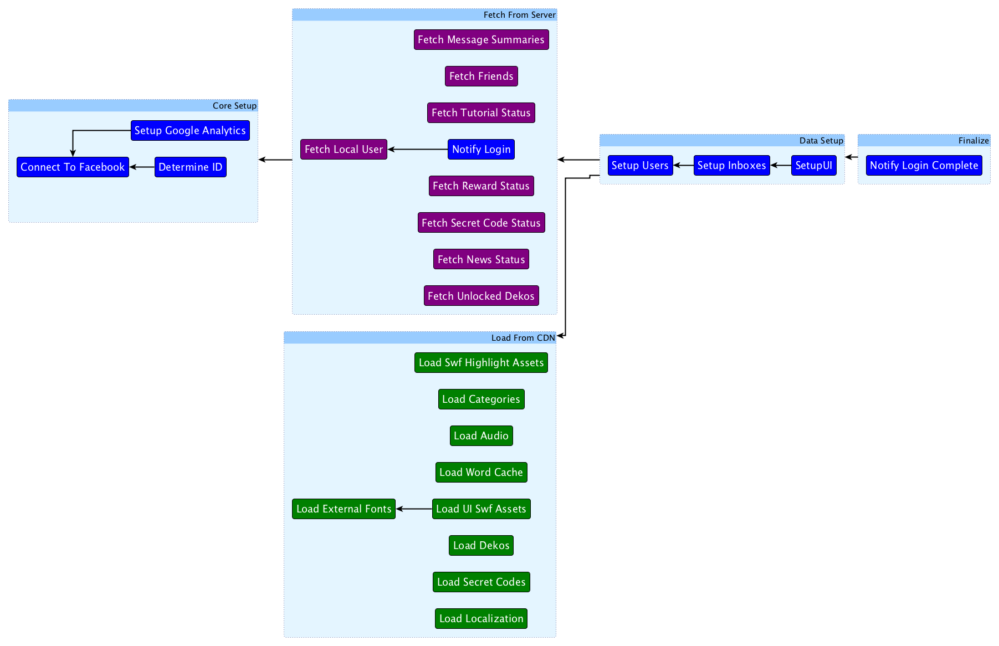

# Dependency Graphs

####Overview

Dependency graphs are where it all comes together!  By using the process class, we can create a dependency graph that allows us to ensure a program is in an expected state when executing dependant code.
 
I used [yEd](https://www.yworks.com/products/yed) to create dependency graphs visually, and a separate tool I wrote converted the xml from yEd to lua files which in turn creates the dependency graphs in C++ during execution.  Using the yEd tool is useful, because the moment you realize one process is dependent on another, all you have to do is draw the dependency line and the code will execute accordingly.

####Sample Graph
 Here is an example of a graph. Each node represents a [Process](/Process) sub-class, and dependencies are represented by arrows.  If a arrow points to a group, then all processes in that group must complete first.  This specific graph was used for logging into our instant messaging system [Doki-Doki Mail](https://www.youtube.com/watch?v=H7hFijr5v-c).  Some details:  
* The __Core Setup__ group at the left grabs the Facebook ID and sets up Google analytics.
* The __Load From CDN__ has no dependencies, as it is loading resources from a server, so it can start right away.
* The __Fetch From Server__ pulls a bunch of relavant data from our server to the runtime.  Since we need a Facebook ID for this, it is dependent on the Core Setup group
* The __Data Setup__ group uses all the user and content fetched from the server to load the final UI and start the app.
 
Since there are a lot of small tasks, and each of them are a http hit, the dependency graph can execute all these tasks concurrently, and resolve dependencies when they come back completed.  

The process classes are a way of compartmentalizing sections of code into objects that can be grouped and re-arranged.  Once a process is kicked off you wait for the end event to be fired to indicate it is finished with the process.  Similar to Apple's NSOperation class.  

File breakdowns:

* [DependencyGraphNode.h](DependencyGraphNode.h)/[cpp](DependencyGraphNode.cpp) is the base node class for the graph.  Has an ID and a list of nodes it is dependent on.  The graph nodes are just data, they don't handle active or cleared dependencies.
* [DependencyGraphTraverser.h](DependencyGraphTraverser.h)/[cpp](DependencyGraphTraverser.cpp) is the class that traverses the graph.  It tracks cleared and active dependencies.  A callback can be supplied to execute specific code.  You can use more than one traverser on the same graph.
* [DependencyGraphProcess.h](DependencyGraphProcess.h)/[cpp](DependencyGraphProcess.cpp) is a process class that simply takes a dependency graph and notifies when the graph has completed execution.
* [ProcessTraverserCallback.h](ProcessTraverserCallback.h)/[cpp](DependencyGraphCallback.cpp) is where all the work of DependencyGraphProcess happens.  This class takes each node in the graph and maps it to a process class which is executed during a traversal.  When the process is complete, it notifies the traverser to update any dependencies.

####Something completely different

Dependency graphs are just one type of graph that the process system can use.  In a previous project I also had an execution flow graph to manage the flow of gameplay.  This is out of the scope of this example, but I've included it as an sample of what else is possible.
